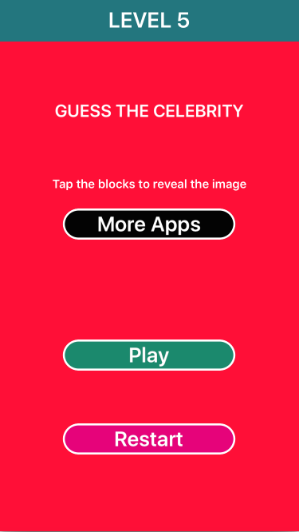
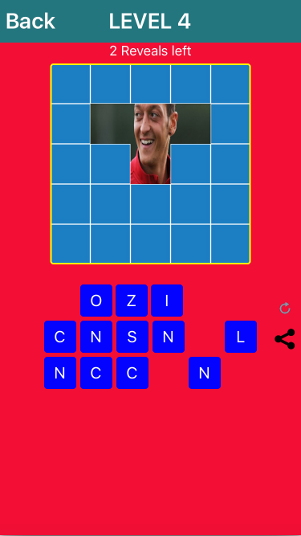

##GuessCelebrity
========================

##Language

Objective-C

##How to play

Its very easy to play.Start button leads to you the main game board. It is 5x5 grid. You have maximum 6 chance to open the grid. Base on this you have to guess the celebrity name and co-ordinate the character of the celebrity name. Its very simple and funny.

## Contributing

Forks, patches and other feedback are welcome.

## Creator

[Muzahidul Islam](http://mmsaddam.github.io/) 
[Blog](http://mmsaddam.github.io/)

## License

GuessCelebrity is available under the MIT license. See the LICENSE file for more info.